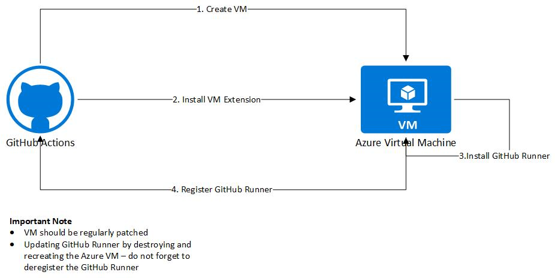

# Deploy GitHub self-hosted runners to Azure

## Folder structure
- **.github/workflows** - _GitHub Actions workflows_
  - vm-deploy.yml - _GitHub Actions workflow for deploying the GitHub self-hosted runner on a VM_
  - container-deploy.yml - _GitHub Actions workflow for deploying the GitHub self-hosted runner as container_
- **docs** - _Documentation_
- **src** - _Source code_
  - vm - _Scripts for deploying GitHub self-hosted runner on a VM_
  - container - _Scripts for deploying GitHub self-hosted runner as container_
  - utils - _Utilities to cleanup GitHub self-hosted runners, trigger the GitHub Actions workflows, ..._

## Architecture

### VM
 

### Container
 

**Remark:** _[Azure Kubernetes Service](https://github.com/myoung34/docker-github-actions-runner#kubernetes) is a better option for hosting your containers._

## Credits
Kudos to [Marcus Young](https://github.com/myoung34/docker-github-actions-runner) for his excellent work around packaging GitHub self-hosted runners as containers.
